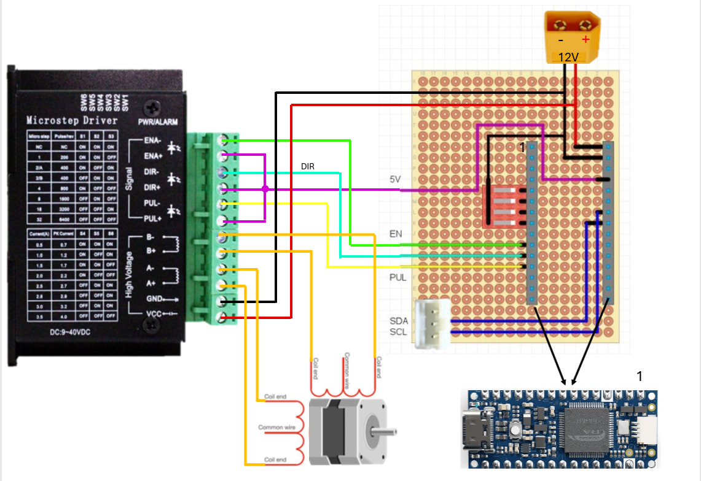

# WetenschappenlijkProject - Steppermotorcontroller

## Overzicht

Een compleet regelsysteem voor een steppermotor, bestaande uit:
- **Arduino Nano R4-slave** (`Slave/`): I2C-slavemicrocontroller die rechtstreeks een TB6600 steppermotordriver aanstuurt via PWM en GPIO
- **Python-mastercontroller** (`Master/`): Python-API op hoog niveau voor bediening op afstand via I2C vanaf een Raspberry Pi of Linux-computer

### Architectuur

```
┌─────────────────────────────────────────────────────────────┐
│                    Master (Python)                          │
│                   - API op hoog niveau                      │
│               - Motorbesturingsopdrachten                   │
│                - Foutafhandeling & opnieuw proberen         │
└────────────┬────────────────────────────────────────────────┘
             │ I2C-bus (SMBus) - 400 kHz
             │ SDA (GPIO 2) / SCL (GPIO 3) op de RPi
             ↓
┌─────────────────────────────────────────────────────────────┐
│              Arduino Nano R4 (slave)                        │
│        - I2C-registerinterface (0x20-0x2F)                  │
│        - Bewegings-toestandsmachine                         │
│        - Hardwarematige PWM-pulsopwekking                   │
│        - Adresconfiguratie via DIP-schakelaars              │
└────┬────────────────────────────────────────┬───────────────┘
     │ GPIO Pinnen                              │ I2C
     ├─ Pin 7 (EN)  ────→ TB6600 ENABLE -     ├─ SDA (pin 18)
     ├─ Pin 8 (DIR) ────→ TB6600 DIRECTION -  └─ SCL (pin 19)
     └─ Pin 9 (PUL) ────→ TB6600 PULSE -
             ↓
    ┌────────────────────┐
    │ TB6600-steppermotor│
    │ driver             │
    │ (step/direction    │
    │  interface)        │
    └────────────────────┘
             ↓
    ┌────────────────────┐
    │  Steppermotor      │
    │  (NEMA17, enz.)    │
    └────────────────────┘
```

---

## Snel aan de slag

### 1. Arduino-instelling (slave)

#### Benodigdheden
- Arduino Nano R4
- TB6600 steppermotordriver
- Steppermotor (bijvoorbeeld NEMA17 met 200 stappen/omwenteling)
- 4x DIP-schakelaars (voor I2C-adresconfiguratie)
- Breadboard en jumperdraden

#### Bedrading



| Signaal | Arduino Pin | TB6600 Pin  | Doel |
|--------|-------------|------------|---------|
| **PUL** | 9 | PUL- | Pulssignaal (stijgende flank = 1 stap) |
| **DIR** | 8 | DIR- | Richtingsregeling (HIGH=vooruit, LOW=achteruit) |
| **EN** | 7 | EN- | Driver inschakelen (HIGH=ingeschakeld, LOW=uitgeschakeld) |
| **SDA** | 18 | / | I2C data lijn |
| **SCL** | 19 | / | I2C klok lijn |
| **GND** | GND | GND | Gemeenschappelijke massa |
| **5V** | 5V | EN+, DIR+, PUL+ * | Arduino 5V uitgangspanning** |
| **VIN** | VIN | VCC | Arduino ingang spanning (6-21V)*** |

\* In dit scenario zijn de + pinnen van de EN-, DIR- en PUL-ingangen verbonden met de 5V en de - pinnen met de Arduino. Dit zorgt voor een configuratie waarbij de ingangen als actief hoog worden beschouwd. Indien je ze als actief laag wilt gebruiken, moeten de - pinnen met de grond verbonden worden en de + pinnen met de Arduino. <br>
\*\* Andere spanningen zijn ook mogelijk, maar dan moet je extra weerstanden gebruiken. In de documentatie van de TB6600 stepper motor driver raden ze een stroom van 8–15 mA aan. <br>
\*\*\* In dit scenario zijn de motor en de Arduino verbonden met dezelfde voedingsbron. Dit is niet noodzakelijk. Je kan aparte voedingsbronnen gebruiken voor de Arduino en de stappenmotor indien nodig. Zorg er wel voor dat de massas met elkaar verbonden zijn.


#### I2C-adresconfiguratie (DIP-schakelaars)

Het I2C-slaveadres van de Arduino wordt ingesteld met 4 DIP-schakelaars op Arduino-pinnen 2, 3, 4 en 5:

| DIP | Pin | Binaire Positie |
|-----|-----|-----------|
| S0 | 5 | bit 0 |
| S1 | 4 | bit 1 |
| S2 | 3 | bit 2 |
| S3 | 2 | bit 3 |

**Eindadres I2C = 0x20 + (waarde van de DIP-nibble)**

**Veelvoorkomende configuraties:**
- Alles OFF (0000): **0x20**
- Bit 3 ON (1000): **0x28**
- Bit 0 ON (0001): **0x21**
- Alles ON (1111): **0x2F**

#### Arduino-sketch uploaden

1. Installeer [Arduino IDE](https://www.arduino.cc/en/software)
2. Open `Slave/StepperMotorController/StepperMotorController.ino`
3. Kies bord: **Arduino Nano R4**
4. Kies de poort*: `/dev/ttyUSB0` or `/dev/ttyACM0` (Linux) or `COM3` (Windows)
5. Klik op **Upload**

\* De poort kan varieren per apparaat.

---

### 2. Python-instelling (master)

#### Installatie

```bash
# Python-afhankelijkheden installeren
cd Master
pip install smbus2

# Optioneel: voor ontwikkeling
pip install -e src/
```

#### I2C-verbinding controleren

```bash
# Aangesloten I2C-apparaten tonen
i2cdetect -y 1
```

**Voorbeeld van verwachte uitvoer (Arduino op adres 0x20):**
```
   0  1  2  3  4  5  6  7  8  9  a  b  c  d  e  f
00:                         -- -- -- -- -- -- -- --
10: -- -- -- -- -- -- -- -- -- -- -- -- -- -- -- --
20: 20 -- -- -- -- -- -- -- -- -- -- -- -- -- -- --
30: -- -- -- -- -- -- -- -- -- -- -- -- -- -- -- --
40: -- -- -- -- -- -- -- -- -- -- -- -- -- -- -- --
50: -- -- -- -- -- -- -- -- -- -- -- -- -- -- -- --
60: -- -- -- -- -- -- -- -- -- -- -- -- -- -- -- --
70: -- -- -- -- -- --
```

Als je Arduino hier staat (in dit geval op `20`), betekent dit dat de I2C-verbinding goed werkt.

#### Snelle test

```python
from src.stepper_i2c import StepperController

# Controller aanmaken (adres hangt af van de DIP-schakelaarconfiguratie)
with StepperController(address=0, bus=1) as motor:
    print("Motorstatus:", motor.get_state())

    # 100 stappen verplaatsen op 50% snelheid
    motor.move_steps(100, speed_percent=50.0, clockwise=True)
    motor.wait_until_complete(timeout_sec=10)

    print("Klaar!")
```

## Gebruik van de Python-API

### Basisbediening

```python
from src.stepper_i2c import StepperController

with StepperController(address=0, bus=1) as motor:
    # Huidige toestand ophalen
    state = motor.get_state()
    print(f"Snelheid: {state['speed_percent']}%")
    print(f"Beweegt: {state['enabled'] and not state.get('is_complete', True)}")

    # Motor bedienen
    motor.set_direction(clockwise=True)
    motor.set_speed_percent(75.0)
    motor.enable(True)

    # Stoppen
    motor.stop()
```

### Voorbeelden

Zie het volledige voorbeeld in `Master/`:
- **draw_robot.py** – Tekentoepassing met meerdere assen en twee motoren die parallel draaien

Voor gedetailleerde API-documentatie en meer gebruikspatronen, zie [Master/CONTROLLER_DOCUMENTATION.md](Master/CONTROLLER_DOCUMENTATION.md).

---

## Problemen oplossen

### Arduino wil niet uploaden
- Controleer de USB-kabel (een datakabel, geen alleen-voedingskabel)
- Controleer of het juiste bord is gekozen: **Arduino Nano R4**
- Probeer een andere USB-poort
- Werk de Arduino IDE-bootloader bij

### I2C niet gedetecteerd
```bash
# Controleer of de Arduino zichtbaar is
i2cdetect -y 1
```

**Voorbeeld van een lege output (Arduino niet gevonden):**
```
   0  1  2  3  4  5  6  7  8  9  a  b  c  d  e  f
00:                         -- -- -- -- -- -- -- --
10: -- -- -- -- -- -- -- -- -- -- -- -- -- -- -- --
20: -- -- -- -- -- -- -- -- -- -- -- -- -- -- -- --
30: -- -- -- -- -- -- -- -- -- -- -- -- -- -- -- --
40: -- -- -- -- -- -- -- -- -- -- -- -- -- -- -- --
50: -- -- -- -- -- -- -- -- -- -- -- -- -- -- -- --
60: -- -- -- -- -- -- -- -- -- -- -- -- -- -- -- --
70: -- -- -- -- -- -- -- --
```

**Als dit gebeurt, probeer dan:**
1. Controleer de bedrading van SDA/SCL (pinnen 18/19 op de Nano R4)
2. Controleer of er pull-upweerstanden aanwezig zijn op SDA en SCL
3. Controleer of de DIP-schakelaarinstelling overeenkomt met jouw slaveadres

### Motor beweegt niet
1. **Controleer de DIP-schakelaars** - Controleer of het adres overeenkomt met de Python-code
2. **Controleer de bedrading** - EN-, DIR- en PUL-pinnen aangesloten
3. **Test met Python**:
   ```python
   motor.get_state()  # Controleren of de slave reageert
   motor.enable(True)  # Proberen in te schakelen
   ```
4. **Controleer de periodewaarde** - Moet tussen 1000-65535 µs liggen (door de Arduino geregeld)
5. **Controleer de motorspanning** - VMOT moet 12-24V zijn (hangt af van de driver)

### Af en toe I2C-fouten
- Plaats 100nF-condensatoren dicht bij Arduino 5V en GND
- Maak de I2C-kabel korter of gebruik afgeschermde kabels
- Gebruik pull-upweerstanden op SDA/SCL (2,2k-10k)
- Zet I2C-herhalen aan in Python: `i2c_retry_count=5`

### Beweging te snel/te langzaam
- Gebruik de Python-API: `motor.set_speed_percent(50.0)` voor directe bediening
- Snelheidsbereik: 0% (traagst) tot 100% (snelst)
- Minimale praktische periode: 1000 µs (Arduino handhaaft een minimum van 20 µs)

---

## Projectstructuur

```
stepper-motor/
├── README.md                              # Dit bestand
├── assets                                 # Figuren voor de documentatie
├── Master/
│   ├── CONTROLLER_DOCUMENTATION.md        # Volledige Python API-referentie
│   ├── draw_robot.py                      # Voorbeeld voor tekenen met meerdere assen
│   └── src/stepper_i2c/
│       ├── __init__.py                    # Pakketinitialisatie
│       ├── controller.py                  # Hoofdklasse StepperController
│       └── constants.py                   # I2C-registerdefinities
└── Slave/
    └── StepperMotorController/
        └── StepperMotorController.ino     # Arduino-sketch (I2C-slave)
```

---

## Belangrijkste functies

✅ **Arduino-slave:**
- I2C-interface op basis van registers
- Slaveadres instelbaar met DIP (0x20-0x2F)
- Hardwarematige PWM-pulsopwekking
- Bewegings-toestandsmachine (continu/finit)
- Robuuste I2C-communicatie met timeout

✅ **Python-master:**
- API op hoog niveau voor motorbediening
- Snelheidsregeling in % of RPM
- Relatieve beweging (stappen, graden, omwentelingen)
- I2C-foutpogingen met exponentiële vertraging
- Contextmanager voor beheer van bronnen
- Detectie van beweging voltooid

---

## Specificaties

| Parameter | Waarde | Opmerking |
|-----------|--------|-----------|
| I2C-bussnelheid | 400 kHz | Standaard SMBus-snelheid |
| I2C-adresbereik | 0x20-0x2F | 16 mogelijke adressen via DIP |
| Stappenperiodebereik | 20-65535 µs | Arduino: min. 20 µs, Python: min. 1000 µs |
| Pulstelling | 0-65535 | 0 = continu, >0 = finite beweging |
| Controle van beweging voltooid | Polling | Lees REG_MOTION_COMPLETE_FLAG |
| Maximaal aantal gelijktijdige motoren | 16 | Beperkt door I2C-adressen (een per master) |

---

## Opmerkingen

- **Geen positietracking** - Alle bewegingen zijn relatief
- **I2C-timeout** - De Arduino heeft een I2C-timeout van 25 ms; als de master vastloopt, reset de Arduino
- **Minimum stappenperiode** - De Arduino handhaaft een minimum van 20 µs (Python gebruikt standaard 1000 µs voor stabiliteit)
- **Aparte voedingen aanbevolen** - Motorspanning (12-24V) apart van logicaspanning (5V)